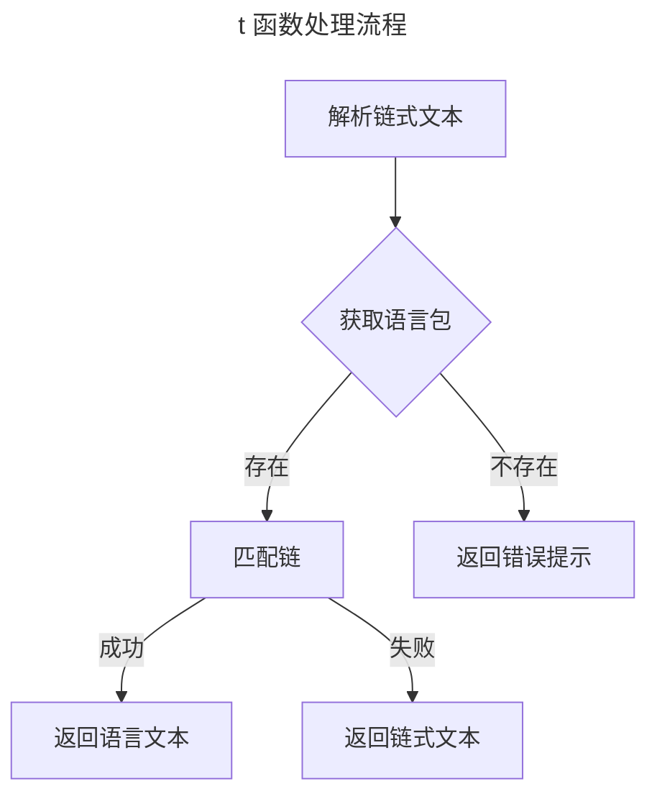

在现代化 web 开发中，国际化通常是前端需要做的事情，但是，在一些国际场景中，后端国际化也是必不可缺的一部分，它能为特定语言的用户反馈他们的母语提示，极大的方便了全球用户

## 语法

与前端工程常见用法基本一致，只需使用 `t()` 函数 + 链式文本即可，例如：

* `t('response.success')`

获取语言包中的 response 下的 success 字段值

* `t('error.captcha.expired‘)`

获取语言包中的 error 下的 captcha 下的 expired 字段值

## 默认语言

可以在 [配置文件](./conf.md) 中设置默认语言

## 动态切换

fba 将自动获取请求头中的 `Accept-Language` 参数，并应用第一个参数值为当前语言，如果此参数不存在，则应用默认语言

## 语言包

语言包位于 `backend/app/locale` 目录下

### 命名

语言包文件的命名通常遵循国家/地区代码，例如，`en-US` 表示英语，`zh-CN` 表示简体中文

### 格式

语言包目前支持两种格式：

* json
* yaml / yml
