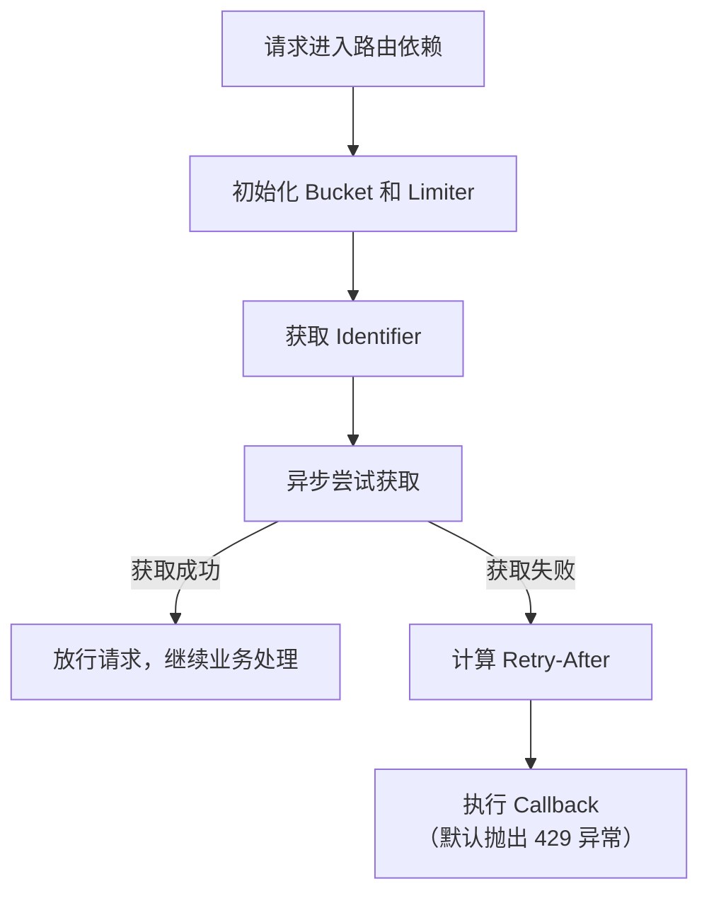

在现代 Web 开发中，API 限流（Rate
Limiting）是保护后端服务、防止资源滥用、保证服务稳定性的重要机制，我们有一个关于路由器的历史讨论，如果你感兴趣，可以查看：[#70](https://github.com/fastapi-practices/fastapi_best_architecture/discussions/70)

## 处理流程

以下是 RateLimiter 处理一次请求的完整流程：



## 使用方法

RateLimiter 设计为 FastAPI 的依赖项，直接在路由中使用 `Depends` 注入

### 单规则限流

```python
# 每分钟最多 60 次
@app.get(
    "/api/example", 
    dependencies=[Depends(RateLimiter(Rate(5, Duration.MINUTE)))]
)
async def example():
    return {"message": "success"}
```

### 多规则复合限流

```python
# 每秒 10 次 + 每分钟 100 次
@app.post(
    "/api/heavy", 
    dependencies=[
        Depends(
            RateLimiter(
                Rate(10, Duration.SECOND),
                Rate(100, Duration.MINUTE),
            )
        )
    ]
)
async def heavy_endpoint():
    return {"status": "ok"}
```

### 自定义 Identifier

```python
async def user_identifier(request: Request) -> str:
    return f"user:{request.user.id}"


@app.get(
    "/api/user-data",
    dependencies=[
        Depends(
            RateLimiter(
                Rate(50, Duration.MINUTE),
                identifier=user_identifier,
            )
        )
    ]    
)
async def user_data():
    return {"data": "protected"}
```
